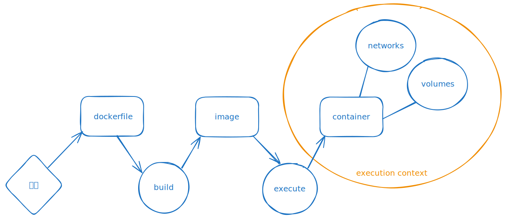

# Docker starter kit

## How Docker works



- **Dockerfile**: Un fichier Dockerfile est un script qui contient une série d'instructions pour construire une image Docker. Les instructions incluent des commandes pour copier des fichiers, installer des logiciels, définir des variables d'environnement, etc. Les fichiers Dockerfile sont utilisés pour automatiser le processus de construction d'images Docker.

- **Image Docker**: Une image Docker est un modèle immuable qui contient le code source, les bibliothèques, les dépendances, les outils et autres fichiers nécessaires pour exécuter une application.
Les images sont utilisées pour créer des conteneurs. Pour décrire une image, on utilise un fichier Dockerfile qui spécifie comment construire l'image.
L'héritage est possible, une image peut être basée sur une autre image, ainsi, on peut profiter des logiciels et configurations de l'image parente.

Par exemple, pour une image basée sur Ubuntu :

```Dockerfile
FROM ubuntu:20.04
RUN apt-get update && apt-get install -y nginx
CMD ["nginx", "-g", "daemon off;"]
```

- [**Docker Hub**](https://hub.docker.com) : Docker Hub est un service de registre qui permet de trouver, partager et gérer des images Docker. Les utilisateurs peuvent pousser leurs images sur Docker Hub pour les 
rendre accessibles à d'autres, ou télécharger des images publiques pour leur propre utilisation. Docker Hub contient une vaste bibliothèque d'images officielles et communautaires.
On peut reconnaître les [images officielles](https://hub.docker.com/search?image_filter=official) par leur nom d'utilisateur `library`, par exemple `library/ubuntu` ou encore par le "_" dans l'url d'une image, par exemple `/_/ubuntu`.

> Attention : Ne vous laissez pas berner par des images communautaires qui pourraient contenir des logiciels malveillants.

- [**GitHub**](https://docs.github.com/fr/packages/working-with-a-github-packages-registry/working-with-the-docker-registry) & [**Azure**](https://azure.microsoft.com/fr-fr/products/container-registry/) : disposent de leur propre registre d'images Docker. 
 
- **Conteneur** : Un conteneur est une instance exécutable d'une image Docker. Il encapsule l'application et son environnement d'exécution. Plusieurs conteneurs peuvent être lancés à partir de la 
même image, fonctionnant isolément les uns des autres. Les conteneurs partagent le même noyau de système d'exploitation, mais peuvent être restreints en termes de CPU, mémoire, et autres ressources.
En d'autres termes, les conteneurs fonctionnent comme des machines virtuelles.

- **Volume** : Un volume est un mécanisme pour persister et partager des données entre conteneurs et le système hôte. Contrairement aux données dans les couches d'une image Docker, les données dans 
un volume ne sont pas supprimées lorsque le conteneur est détruit. Les volumes sont utiles pour sauvegarder, restaurer et partager des données.  

- **Network** : Docker utilise des réseaux pour permettre aux conteneurs de communiquer entre eux.
Par défaut, Docker propose plusieurs types de réseaux (bridge, host, none, etc.), mais vous pouvez aussi créer vos propres réseaux.
Cela permet de contrôler la manière dont les conteneurs communiquent entre eux et avec l'extérieur.

Exemple de création et gestion d'un conteneur, volume, et réseau :

```shell
# Télécharger une image Ubuntu depuis Docker Hub
docker pull ubuntu:20.04

# Créer et démarrer un conteneur à partir de l'image Ubuntu
docker run -d --name mon-ubuntu ubuntu:20.04

# Créer un volume pour persister des données
docker volume create mon-volume

# Attacher le volume au conteneur pour persister des données
docker run -d --name mon-ubuntu-avec-volume -v mon-volume:/data ubuntu:20.04

# Créer un réseau personnalisé
docker network create mon-reseau

# Connecter le conteneur au réseau personnalisé
docker network connect mon-reseau mon-ubuntu
```

## Docker Essential Cheat Sheet

[Voir le Gist](https://gist.github.com/abenevaut/051d8fd214476eceab54d8f4b46da700)
