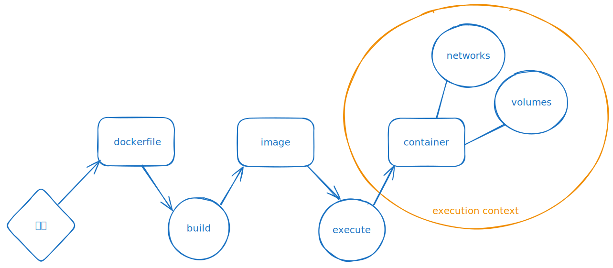

# Docker starter kit

## How Docker works



- **Dockerfile**: A Dockerfile is a script that contains a series of instructions to build a Docker image.
The instructions include commands to copy files, install software, set environment variables, etc.
Dockerfiles are used to automate the process of building Docker images.

- **Docker Image**: A Docker image is an immutable template that contains the source code, libraries, dependencies, tools, and other files needed to run an application.
Images serve as a starting point for creating containers. To describe an image, a Dockerfile is used to specify how to build the image.
Inheritance is possible; an image can be based on another image, allowing the use of the software and configurations of the parent image.
 
For example, for an image based on Ubuntu:

```Dockerfile
FROM ubuntu:20.04
RUN apt-get update && apt-get install -y nginx
CMD ["nginx", "-g", "daemon off;"]
```

- [**Docker Hub**](https://hub.docker.com): Docker Hub is a registry service that allows finding, sharing, and managing Docker images. Users can push their images to Docker Hub to make them accessible to others or download public images for their own use. Docker Hub contains a vast library of official and community images. [Official images](https://hub.docker.com/search?image_filter=official) can be recognized by their username `library`, for example, `library/ubuntu`, or by the "_" in the image URL, for example, `/_/ubuntu`.

> Warning: Do not be misled by community images that may contain malware.

- [**GitHub**](https://docs.github.com/fr/packages/working-with-a-github-packages-registry/working-with-the-docker-registry) & [**Azure**](https://azure.microsoft.com/fr-fr/products/container-registry/): have their own Docker image registries.

- **Container**: A container is an executable instance of a Docker image. It encapsulates the application and its runtime environment. Multiple containers can be launched from the same image, running independently of each other. Containers share the same operating system kernel but can be limited in terms of CPU, memory, and other resources. In other words, containers are like virtual machines.

- **Volume**: A volume is a mechanism to persist and share data between containers and the host system. Unlike data in the layers of a Docker image, data in a volume is not deleted when the container is destroyed. Volumes are useful for backup, restore, and data sharing.

- **Network**: Docker uses networks to enable communication between containers. By default, Docker provides several networks (bridge, host, none, etc.), but users can also create their own networks. This allows controlling how containers communicate with each other and with the outside world.

Example of creating and managing a container, volume, and network:

```shell
# Pull an Ubuntu image
docker pull ubuntu:20.04

# Create and start a container from the Ubuntu image
docker run -d --name my-ubuntu ubuntu:20.04

# Create a volume to persist data
docker volume create my-volume

# Attach the volume to the container to persist data
docker run -d --name my-ubuntu-with-volume -v my-volume:/data ubuntu:20.04

# Create a custom network
docker network create my-network

# Connect the container to the custom network
docker network connect my-network my-ubuntu
```

## Docker Essential Cheat Sheet


